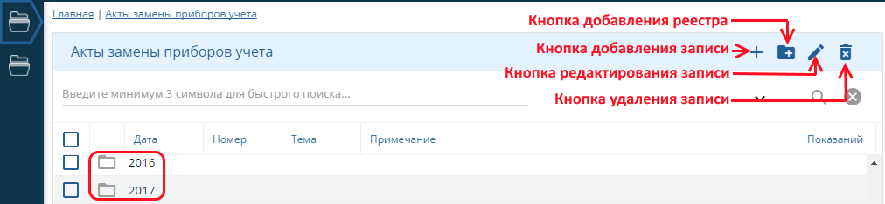
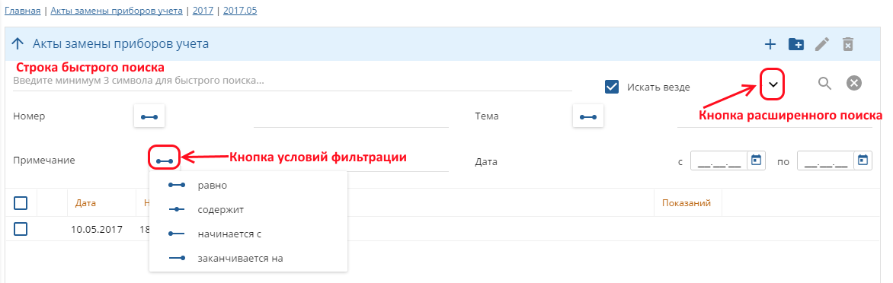
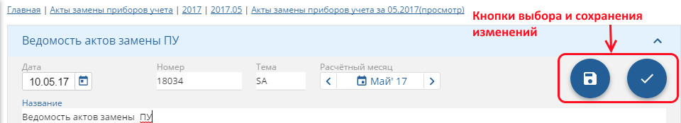
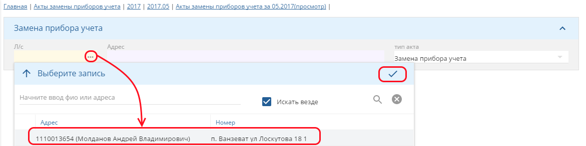
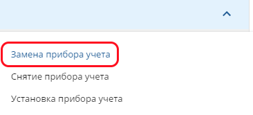
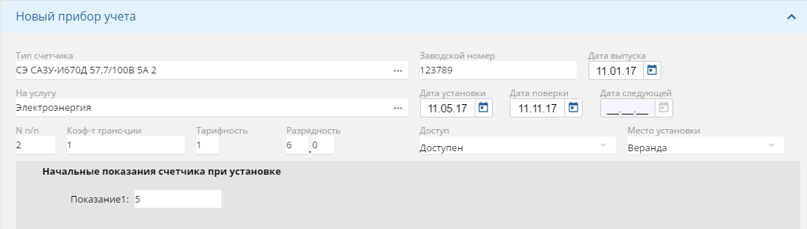
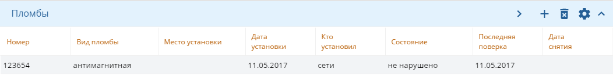
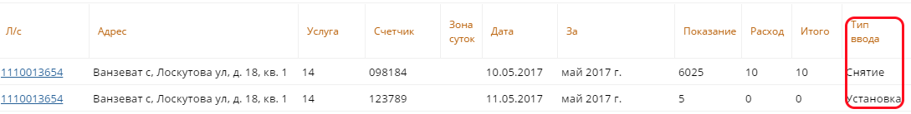

Акты замены приборов учета
===========================
На интерфейсе *Акты замены приборов учета* в иерархическом порядке располагаются реестры ведомостей замены ПУ, в виде каталогов  с делением по годам, месяцам, районам, улицам  и т.д. Выбор организации хранения данных устанавливается пользователем. В каталогах находятся ведомости замены ПУ. Добавление реестров ведомостей, отдельных ведомостей, редактирование и удаление производится соответствующими кнопками на верхней рабочей панели интерфейса.

 
В программе реализована возможность быстрого поиска по минимум трем введенным символам, а также функция расширенного поиска по кнопке со стрелкой вниз. Расширенный поиск ведется в разрезах номера, темы, примечаний, даты. Для поиска по номеру, теме и примечанию следует воспользоваться кнопкой условий фильтрации.

 
Создадим новую ведомость по кнопке *Добавить запись* и заполним поля: *Дата создания ведомости*, ее порядковый *Номер* (проставляется автоматически), *Тема*, *Расчетный месяц* и *Наименование ведомости*.

 
Рассмотрим процесс создания акта замены ПУ в ведомости. Создадим новый акт по кнопке *Добавить запись*. Выберем нужный лицевой счет из адресного списка по кнопке *Выбора записи*. Поле *Адрес* заполняется автоматически.

 
Выберем тип акта, например, *Замена прибора учета*.

 
Выберем счетчик, подлежащий замене на лицевом счете, заполним поля *Дата* и *Причина снятия*.

.. image:: ./Pictures/Lichny_kabinet_kontrolera_akty_zameny_PU/Причина_замены.png
 
Далее вносим новое *Показание счетчика* и *Дополнительный расход* (при его наличии). Поля *Расход* и *Итого* заполняются автоматически.

.. image:: ./Pictures/Lichny_kabinet_kontrolera_akty_zameny_PU/Занесение_показаний.png
 
Вносим данные по новому счетчику. Тип счетчика, на какую он услугу, его заводской номер и дату выпуска, технические характеристики счетчика, а также дату установки и поверки,  информацию о месте установки и возможности доступа. Важно внести начальные показания счетчика при установке, иначе они автоматически будут приравнены к нулю.

 
Вносим информацию о пломбах. Обязательными для заполнения полями являются *Дата установки* и *Последняя поверка*, причем дата установки пломбы обязательно следует не ранее даты установки счетчика.

 
Проверяем корректность всех внесенных данных и нажимаем на кнопку *Заменить* в нижнем левом углу. В итоге в ведомости отражается снятие старого счетчика и установка нового. Аналогичные действия выполняются для типов актов *Снятие прибора учета* и *Установка прибора учета*.

 
При входе на карточку лицевого счета видим отразившиеся изменения.

.. image:: ./Pictures/Lichny_kabinet_kontrolera_akty_zameny_PU/отображение_с_карты_лс.png
 