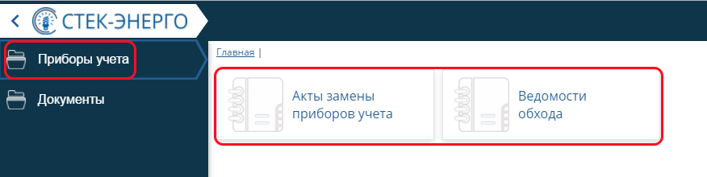

Начало работы в программе
=============================
В окне входа в программу требуется указать имя пользователя и соответствующий пароль.

.. image:: ./Pictures/Lichny_kabinet_kontrolera_nachalo_raboty/Окно_входа_в_Стек_энерго.png

 
В Личном кабинете контролера есть два рабочих места: *Приборы учета* и *Документы*.

.. image:: ./Pictures/Lichny_kabinet_kontrolera_nachalo_raboty/Рабочие_места.png
 
На рабочем месте *Приборы учета* доступны интерфейсы: *Акты замены приборов учета* и *Ведомости обхода*. На интерфейсе *Акты замены приборов* ведется реестр ведомостей замены, установки и снятия ПУ. На интерфейсе *Ведомости обхода* формируются ведомости обхода для контролеров исходя из данных фильтрации по длительности непредставления показаний, величине задолженности и давности последнего показания, снятого контролером.

 
Рабочее место *Документы*  содержит интерфейс *Акты безучетного потребления*. На интерфейсе ведется учет нарушений эксплуатации счетчиков, незаконного потребления электроэнергии (бездоговорное и безучетное потребление), а также определяется объем и рассчитывается стоимость незаконно потребленной энергии.  

.. image:: ./Pictures/Lichny_kabinet_kontrolera_nachalo_raboty/Интерфейс_РМ_Документы.png

 